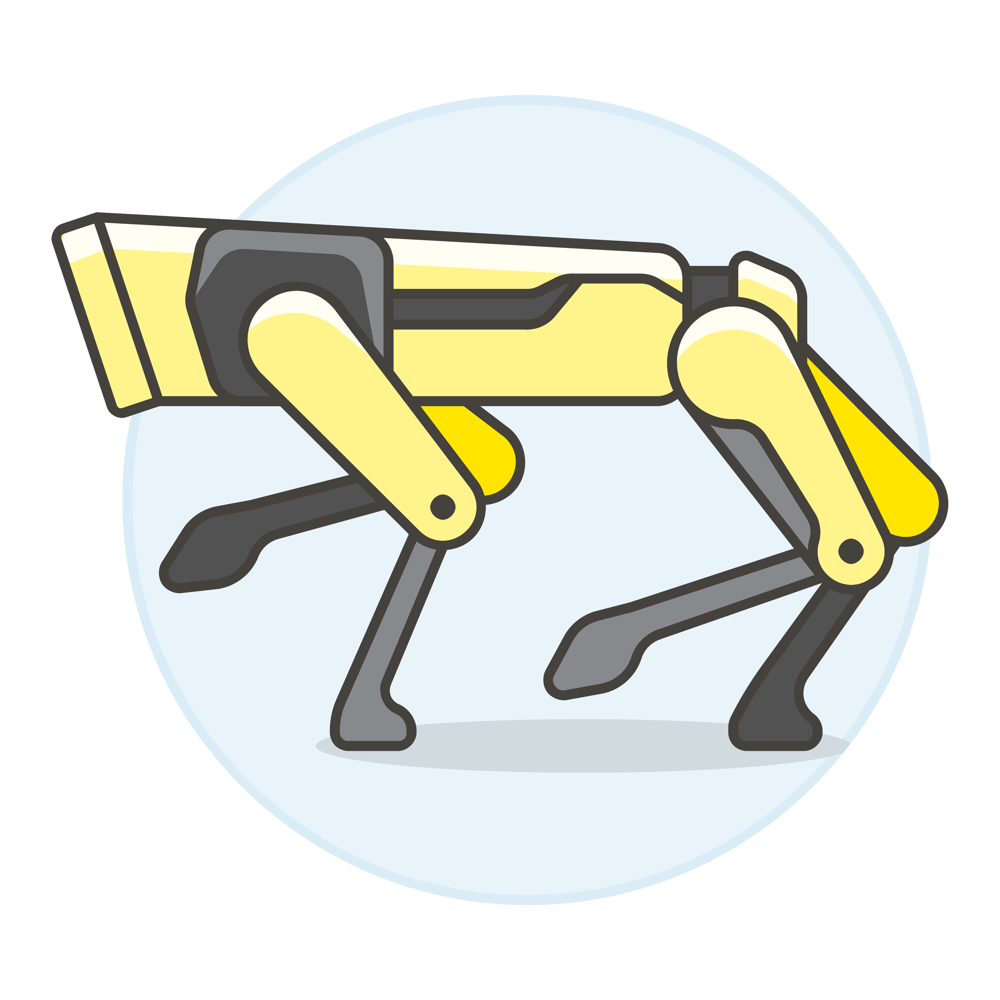
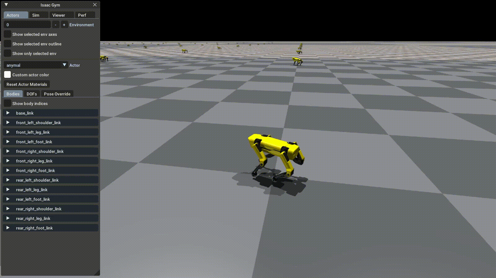

<a id="readme-top"></a>

[![Contributors][contributors-shield]][contributors-url]
[![Forks][forks-shield]][forks-url]
[![Stargazers][stars-shield]][stars-url]
[![Issues][issues-shield]][issues-url]
[![Unlicense License][license-shield]][license-url]
[![LinkedIn][linkedin-shield]][linkedin-url]


<!-- PROJECT LOGO -->
<br />
<div align="center">
  <a href="https://github.com/MrDerrick-007/Quadruped_Robot_CPSP_Project">
    
  </a>

  <h3 align="center">Quadruped Robot Project :smile:
</h3>

  <p align="center">
    Exam project of CPSP by 
     Andrea Manfroni,
     Fabrio Grimandi, 
     Giovanni Oltrecolli, 
     Stefano Maggioreni.
    <br />
    <!--<a href="https://github.com/MrDerrick-007/Quadruped_Robot_CPSP_Project"><strong>Explore the docs »</strong></a> -->

    <!--<a href="https://github.com/MrDerrick-007/Quadruped_Robot_CPSP_Project">View Demo</a> -->
    ·
    <a href="https://github.com/MrDerrick-007/Quadruped_Robot_CPSP_Project/issues/new?labels=bug&template=bug-report---.md">Report Bug</a>
    ·
    <a href="https://github.com/MrDerrick-007/Quadruped_Robot_CPSP_Project/issues/new?labels=enhancement&template=feature-request---.md">Request Feature</a>
  </p>
</div>


<!-- TABLE OF CONTENTS -->
<details>
  <summary>Table of Contents</summary>
  <ol>
    <li>
      <a href="#about-the-project">About The Project</a>
      <ul>
        <li><a href="#built-with">Built With</a></li>
      </ul>
    </li>
    <li>
      <a href="#getting-started">Getting Started</a>
      <ul>
        <li><a href="#prerequisites">Prerequisites</a></li>
        <li><a href="#installation">Installation</a></li>
      </ul>
    </li>
    <li><a href="#usage">Usage</a></li>
    <li><a href="#roadmap">Roadmap</a></li>
    <li><a href="#contributing">Contributing</a></li>
    <li><a href="#license">License</a></li>
    <li><a href="#contact">Contact</a></li>
    <li><a href="#acknowledgments">Acknowledgments</a></li>
  </ol>
</details>


<!-- ABOUT THE PROJECT -->
## About The Project
Starting from the URDF model, the goal is to design and train a neural network to enable the quadruped robot to move forward in a straight line without encountering obstacles. Once this initial phase is complete, the plan is to proceed with the Sim-to-Real transfer. This involves deploying the trained model onto a Raspberry Pi 4 embedded within the 3D-printed quadruped, allowing the movements achieved in simulation to be replicated in the real world.

<details>
  <summary>Isaac Gym Overview</summary>
  <ol>
    Isaac Gym is NVIDIA’s prototype physics simulation environment for reinforcement learning research. It allows developers to experiment with end-to-end      GPU accelerated RL for physically based systems. Unlike other similar ‘gym’ style systems, in Isaac Gym, simulation can run on the GPU, storing results in GPU     tensors rather than copying them back to CPU memory. Isaac Gym includes a basic PPO implementation and a straightforward RL task system that can be used with      it, but users may substitute alternative task systems and RL algorithms as desired. 

  **More information on** 
    https://developer.nvidia.com/isaac-gym
</ol>
</details>


<details>
  <summary>SKRL Overview</summary>
  <ol>
    Skrl is an open-source library for Reinforcement Learning written in Python. It allows loading and configuring NVIDIA Isaac Gym environments, enabling agents’ simultaneous training by scopes (subsets of environments among all available environments), which may or may not share resources, in the same run.

  **Please, visit the documentation for usage details and examples** https://skrl.readthedocs.io
</ol>
</details>

<p align="right"><a href="#readme-top">back to top</a></p>


<!--### Built With

This section should list any major frameworks/libraries used to bootstrap your project. Leave any add-ons/plugins for the acknowledgements section. Here are a few examples.

* [![Next][Next.js]][Next-url]
* [![React][React.js]][React-url]
* [![Vue][Vue.js]][Vue-url]
* [![Angular][Angular.io]][Angular-url]
* [![Svelte][Svelte.dev]][Svelte-url]
* [![Laravel][Laravel.com]][Laravel-url]
* [![Bootstrap][Bootstrap.com]][Bootstrap-url]
* [![JQuery][JQuery.com]][JQuery-url]

<p align="right">(<a href="#readme-top">back to top</a>)</p>
-->


<!-- GETTING STARTED -->
## Getting Started

Instructions on setting up your project locally.
To get a local copy up and running follow these simple example steps.

### Prerequisites
* OS: Ubuntu 20.04

* Python Version: 3.8.10

* Pytorch Version: 2.2.1

* Isaac Gym: [guide for the installation](https://MrDerrick-007.github.io/Quadruped_Robot_CPSP_Project/install.html) 

* Skrl: [installation guide](https://skrl.readthedocs.io/en/latest/intro/installation.html)

### Installation
1. Clone the repo
   ```sh
   git clone https://github.com/MrDerrick-007/Quadruped_Robot_CPSP_Project.git
   ```
2. Go inside "isaccgym envs" folder
   ```sh
   cd Quadruped_Robot_CPSP_Project/isaacgym/isaacgym envs/
   ```
3. Run the simulation with
   ```js
   python3 torch_anymal_ppo.py 
   ```
<p align="right"><a href="#readme-top">back to top</a></p>


<!-- USAGE EXAMPLES -->
## Usage

Use this space to show useful examples of how a project can be used. Additional screenshots, code examples and demos work well in this space. You may also link to more resources.





Nota: l'algoritmo di RL che usate è PPO della classe actor-critic

_For more examples, please refer to the [Documentation](https://example.com)_

<p align="right"><a href="#readme-top">back to top</a></p>


<!-- ROADMAP -->
## Roadmap
- [x] Create a Ubuntu partition
- [x] Isaac Gym
    - [x] Install
    - [x] Try the first examples
- [x] Analyze Isaac's docs and test the Anymal example
- [x] Create a new environment for the robot
- [x] Import the fixed URDF in the Isaac environment
- [x] Training
    - [x] with Anymal's rewards
    - [x] with custom rewards
- [ ] Sim2Real
    - [x] Build the robot
    - [ ] NN deployment in the Raspberry platform 

See the [open issues](https://github.com/MrDerrick-007/Quadruped_Robot_CPSP_Project/issues) for a full list of proposed features (and known issues).

<p align="right"><a href="#readme-top">back to top</a></p>


<!-- CONTRIBUTING -->
## Contributing
If you have a suggestion that would make this better, please fork the repo and create a pull request. You can also simply open an issue with the tag "enhancement".

1. Fork the Project
2. Create your Feature Branch (`git checkout -b feature/AmazingFeature`)
3. Commit your Changes (`git commit -m 'Add some AmazingFeature'`)
4. Push to the Branch (`git push origin feature/AmazingFeature`)
5. Open a Pull Request

### Top contributors:

<a href="https://github.com/MrDerrick-007/Quadruped_Robot_CPSP_Project/graphs/contributors">
  
</a>

<p align="right"><a href="#readme-top">back to top</a></p>


<!-- LICENSE -->
## License

Distributed under the Unlicense License. See `LICENSE.txt` for more information.

<p align="right"><a href="#readme-top">back to top</a></p>


<!-- CONTACT -->
## Contact

* Andrea Manfroni - andrea.manfroni@studio.unibo.it
* Fabio Grimandi  - fabio.grimandi@studio.unibo.it
* Giovanni Oltrecolli - giovanni.oltrecolli2@studio.unibo.it
* Stefano Maggioreni - stefano.maggioreni@studio.unibo.it

Project Link: [https://github.com/MrDerrick-007/Quadruped_Robot_CPSP_Project.git](https://github.com/MrDerrick-007/Quadruped_Robot_CPSP_Project.git)

<p align="right"><a href="#readme-top">back to top</a></p>


<!-- ACKNOWLEDGMENTS -->
## Acknowledgments

List of resources we find helpful for the project.
* [IsaacGym Github](https://github.com/isaac-sim/IsaacGymEnvs/tree/main)
* [SKRL Guide](https://skrl.readthedocs.io/en/latest/intro/installation.html)
* [IsaacGym GetStart Video](https://www.youtube.com/watch?v=nleDq-oJjGk&t=916s&ab_channel=NVIDIAOmniverseYouTube)
* [Robot Assembly Guide](https://github.com/michaelkubina/SpotMicroESP32)
* [Sebastiano Mengozzi Thesis](https://amslaurea.unibo.it/28648/1/SebastianoMengozzi_Thesis.pdf)
* [Sutton, Barto](http://incompleteideas.net/book/the-book-2nd.html)
* [Laura Graesser - Foundations of Deep Reinforcement Learning](https://www.oreilly.com/library/view/foundations-of-deep/9780135172490/)
<!--* [Choose an Open Source License](https://choosealicense.com)
* [GitHub Emoji Cheat Sheet](https://www.webpagefx.com/tools/emoji-cheat-sheet)
* [Malven's Flexbox Cheatsheet](https://flexbox.malven.co/)
* [Malven's Grid Cheatsheet](https://grid.malven.co/)
* [Img Shields](https://shields.io)
* [GitHub Pages](https://pages.github.com)
* [Font Awesome](https://fontawesome.com)
* [React Icons](https://react-icons.github.io/react-icons/search)
-->
<p align="right"><a href="#readme-top">back to top</a></p>


<!-- MARKDOWN LINKS & IMAGES -->
<!-- https://www.markdownguide.org/basic-syntax/#reference-style-links -->
[contributors-shield]: https://img.shields.io/github/contributors/MrDerrick-007/Quadruped_Robot_CPSP_Project.svg?style=for-the-badge
[contributors-url]: https://github.com/MrDerrick-007/Quadruped_Robot_CPSP_Project//graphs/contributors
[forks-shield]: https://img.shields.io/github/forks/MrDerrick-007/Quadruped_Robot_CPSP_Project.svg?style=for-the-badge
[forks-url]: https://github.com/MrDerrick-007/Quadruped_Robot_CPSP_Project/network/members
[stars-shield]: https://img.shields.io/github/stars/MrDerrick-007/Quadruped_Robot_CPSP_Project.svg?style=for-the-badge
[stars-url]: https://github.com/MrDerrick-007/Quadruped_Robot_CPSP_Project/stargazers
[issues-shield]: https://img.shields.io/github/issues/MrDerrick-007/Quadruped_Robot_CPSP_Project.svg?style=for-the-badge
[issues-url]: https://github.comMrDerrick-007/Quadruped_Robot_CPSP_Project/issues
[license-shield]: https://img.shields.io/github/license/MrDerrick-007/Quadruped_Robot_CPSP_Project.svg?style=for-the-badge
[license-url]: https://github.com/MrDerrick-007/Quadruped_Robot_CPSP_Project/blob/master/LICENSE.txt
[linkedin-shield]: https://img.shields.io/badge/-LinkedIn-black.svg?style=for-the-badge&logo=linkedin&colorB=555
[linkedin-url]: https://linkedin.com
[product-screenshot]: images/screenshot.png
[Next.js]: https://img.shields.io/badge/next.js-000000?style=for-the-badge&logo=nextdotjs&logoColor=white
[Next-url]: https://nextjs.org/
[React.js]: https://img.shields.io/badge/React-20232A?style=for-the-badge&logo=react&logoColor=61DAFB
[React-url]: https://reactjs.org/
[Vue.js]: https://img.shields.io/badge/Vue.js-35495E?style=for-the-badge&logo=vuedotjs&logoColor=4FC08D
[Vue-url]: https://vuejs.org/
[Angular.io]: https://img.shields.io/badge/Angular-DD0031?style=for-the-badge&logo=angular&logoColor=white
[Angular-url]: https://angular.io/
[Svelte.dev]: https://img.shields.io/badge/Svelte-4A4A55?style=for-the-badge&logo=svelte&logoColor=FF3E00
[Svelte-url]: https://svelte.dev/
[Laravel.com]: https://img.shields.io/badge/Laravel-FF2D20?style=for-the-badge&logo=laravel&logoColor=white
[Laravel-url]: https://laravel.com
[Bootstrap.com]: https://img.shields.io/badge/Bootstrap-563D7C?style=for-the-badge&logo=bootstrap&logoColor=white
[Bootstrap-url]: https://getbootstrap.com
[JQuery.com]: https://img.shields.io/badge/jQuery-0769AD?style=for-the-badge&logo=jquery&logoColor=white
[JQuery-url]: https://jquery.com 

## Credits
URDF model of [Nicola Russo](https://github.com/nicrusso7)
<p align="right"><a href="#readme-top">back to top</a></p>
